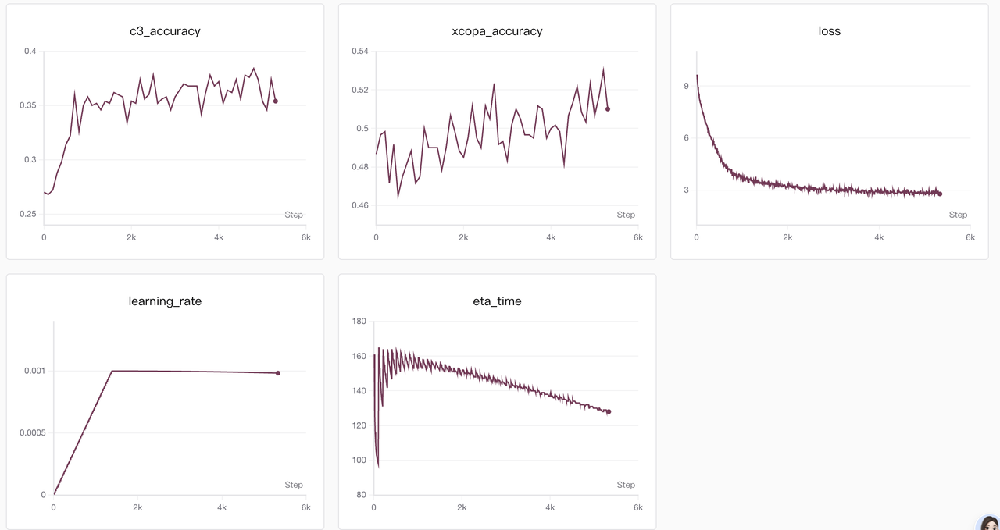
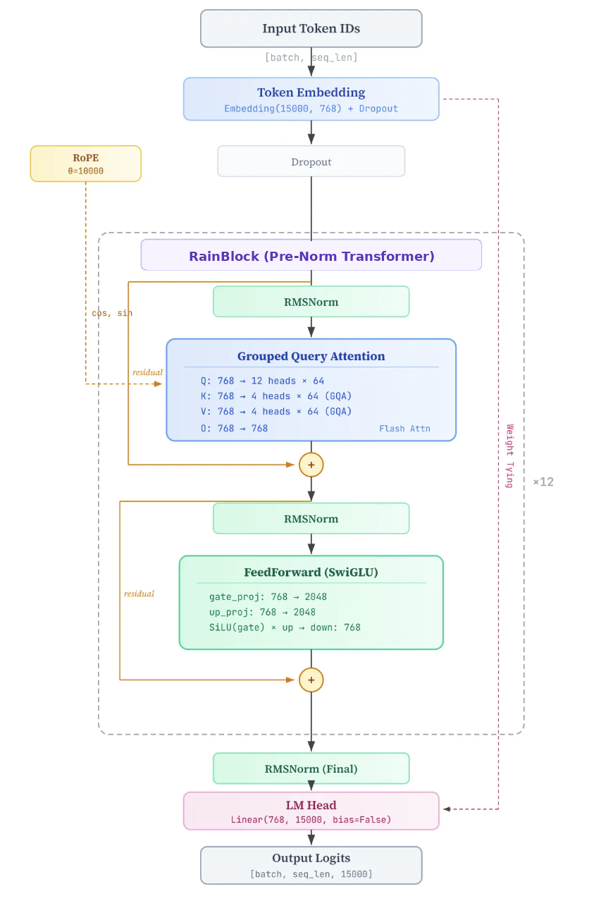
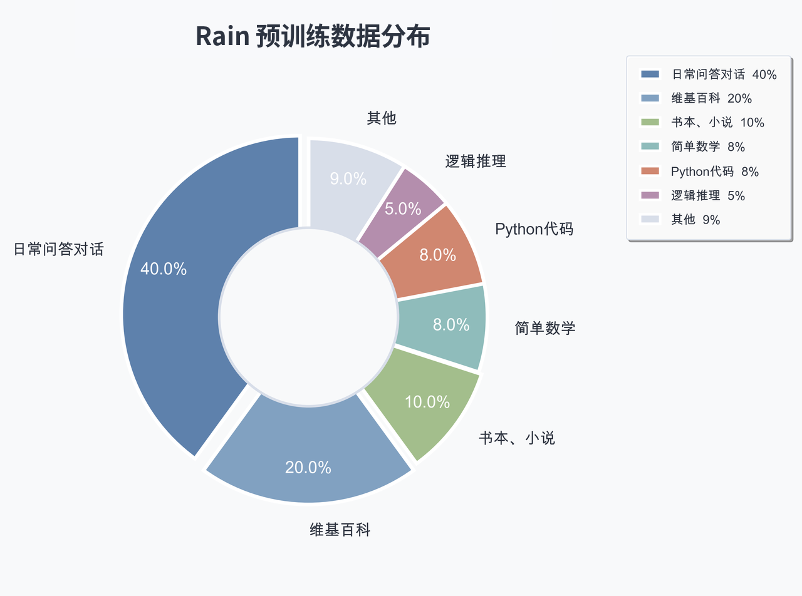
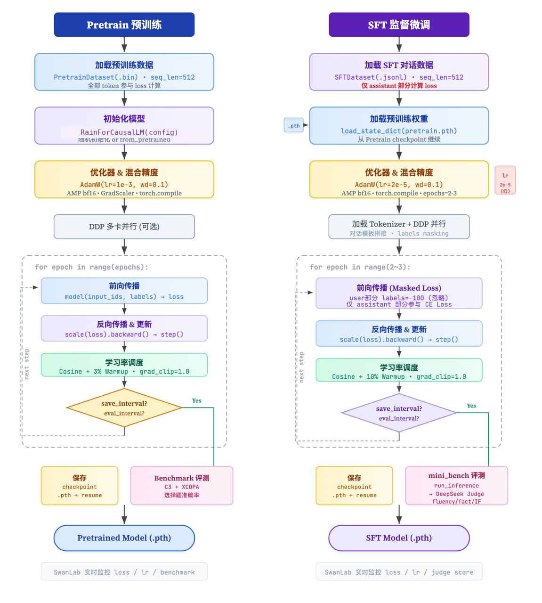

# Rain: 0.1B 中文大语言模型训练框架

Rain 是一个面向中文场景的小参数量 Decoder-only 语言模型项目，覆盖从 Byte-level BPE Tokenizer、预训练、监督微调到 GRPO 强化对齐的完整实验链路。项目目标不是封装黑盒训练接口，而是用尽量清晰的 PyTorch 代码展示一个小型中文 LLM 从数据处理到推理评测的端到端实现。

## 项目概览

- 自研 15K 词表 Byte-level BPE Tokenizer，内置中文对话与 `<think>` 推理格式特殊 token。
- 从零实现 Rain Decoder-only Transformer，支持 RMSNorm、RoPE、SwiGLU、Grouped Query Attention、KV Cache 与 PyTorch SDPA/Flash Attention 路径。
- 预训练支持二进制 `.bin/.meta` 数据读取、混合精度、梯度累积、Warmup + Cosine 学习率、DDP 多卡训练、断点续训与 SwanLab 记录。
- SFT 支持多轮对话 JSONL 数据，只对 assistant 回复部分计算 loss，并提供 mini benchmark + LLM Judge 评测流程。
- GRPO 支持 prompt-only 数据集、组内相对优势估计、reference model KL 约束、格式奖励与 DeepSeek Judge 混合奖励。

## 实验结果

以下为当前实验记录中的代表性结果，具体数值会随数据、训练步数和模型配置变化：

| 阶段 | 指标 | 结果 |
| --- | --- | --- |
| Pretraining | validation loss | `~8.0 -> 2.28` |
| Benchmark | C3 / XCOPA | `0.40 / 0.55` |
| GRPO | 推理 F1 score | `0.45 -> 0.60` |

<p align="center">
  
</p>

## 模型架构

当前代码默认配置见 `model/config.py`：

<p align="center">
  
</p>

```text
RainForCausalLM
├── Token Embedding / LM Head weight tying
├── 12 x RainBlock
│   ├── RMSNorm
│   ├── Grouped Query Attention
│   │   ├── num_attention_heads = 12
│   │   ├── num_key_value_heads = 4
│   │   ├── RoPE
│   │   ├── SDPA / Flash Attention
│   │   └── KV Cache
│   ├── Residual
│   ├── RMSNorm
│   ├── SwiGLU FFN
│   └── Residual
└── Final RMSNorm
```

默认核心参数：

| 参数 | 默认值 |
| --- | --- |
| `vocab_size` | `15000` |
| `hidden_size` | `768` |
| `num_hidden_layers` | `12` |
| `num_attention_heads` | `12` |
| `num_key_value_heads` | `4` |
| `intermediate_size` | `2048` |
| `max_position_embeddings` | `32768` |

## 目录结构

```text
.
├── model/
│   ├── config.py              # RainConfig
│   └── model_rain.py          # Rain 模型主体与 CausalLM 封装
├── train/
│   ├── train_tokenizer.py     # BPE tokenizer 训练/验证
│   ├── pretrain.py            # 预训练入口，支持 DDP
│   ├── train_sft.py           # SFT 训练入口
│   ├── train_grpo.py          # GRPO 强化对齐入口
│   └── utils.py               # 分布式、日志、学习率等工具
├── dataset/
│   ├── preprocess_data.py     # 预训练 JSONL -> bin/meta
│   ├── pretrain_dataset.py    # 预训练数据集
│   ├── sft_dataset.py         # SFT 对话数据集
│   └── grpo_dataset.py        # GRPO prompt 数据集
├── benchmark/
│   ├── evaluator.py           # C3 / XCOPA 多选评测
│   └── mini_benchmark/        # 生成式 mini benchmark + Judge
├── tokenizer_15k/             # 已训练 tokenizer
├── GRPO_train.jsonl           # GRPO 示例训练数据
├── eval.py                    # 交互式推理脚本
└── requirements.txt
```

## 环境安装

建议使用 Python 3.10+ 与 PyTorch 2.0+。GPU 训练推荐使用支持 bfloat16 的 NVIDIA 显卡。

```bash
python -m venv .venv
source .venv/bin/activate
pip install -r requirements.txt
```

如需使用 SwanLab 或 DeepSeek Judge，请使用自己的账号和 API Key。生产环境中不建议把密钥写入代码，推荐通过环境变量或命令行参数传入。

```bash
export DEEPSEEK_API_KEY="your_api_key"
```

## 数据格式

### 预训练数据

<p align="center">
  
</p>

输入 JSONL 每行包含一个 `text` 字段：

```json
{"text": "这里是一段用于语言模型预训练的中文文本。"}
```

预处理为训练用二进制数据：

```bash
python dataset/preprocess_data.py \
  --input data/pretrain.jsonl \
  --output data/pretrain_512 \
  --tokenizer tokenizer_15k \
  --seq_len 512 \
  --num_workers 16
```

该命令会生成：

- `data/pretrain_512.bin`
- `data/pretrain_512.meta`

### SFT 数据

SFT 数据为多轮对话 JSONL，`SFTDataset` 只对 assistant 部分计算 loss：

```json
{"conversations":[{"role":"user","content":"你好"},{"role":"assistant","content":"你好，我是 Rain。"}]}
```

### GRPO 数据

GRPO 数据只需要 prompt，仓库中的 `GRPO_train.jsonl` 已提供 200 条示例：

```json
{"id": 153, "category": "指令与逻辑", "prompt": "计算5减2等于几。"}
```

## 训练流程

<p align="center">
  
</p>

### 1. Tokenizer

仓库已包含 `tokenizer_15k/`，可以直接用于训练和推理。如需重新训练 tokenizer，请在 `train/train_tokenizer.py` 中配置 `DATA_PATH` 与 `TOKENIZER_DIR`，并打开脚本末尾的 `train_tokenizer(...)` 调用后运行：

```bash
python train/train_tokenizer.py
```

### 2. 预训练

单卡训练示例：

```bash
python train/pretrain.py \
  --data_path data/pretrain_512.bin \
  --save_dir out/pretrain \
  --hidden_size 768 \
  --num_hidden_layers 12 \
  --batch_size 128 \
  --learning_rate 1e-3 \
  --use_swanlab 0 \
  --eval_bench 0
```

多卡 DDP 示例：

```bash
torchrun --nproc_per_node=2 train/pretrain.py \
  --data_path data/pretrain_512.bin \
  --save_dir out/pretrain \
  --batch_size 128 \
  --learning_rate 1e-3 \
  --use_swanlab 0 \
  --eval_bench 0
```

断点续训：

```bash
python train/pretrain.py \
  --data_path data/pretrain_512.bin \
  --save_dir out/pretrain \
  --from_resume 1 \
  --use_swanlab 0 \
  --eval_bench 0
```

### 3. SFT

```bash
python train/train_sft.py \
  --data_path data/sft.jsonl \
  --tokenizer_path tokenizer_15k \
  --from_weight out/pretrain/global_step_x/pretrain_768.pth \
  --save_dir out/sft \
  --batch_size 64 \
  --learning_rate 2e-5 \
  --use_swanlab 0 \
  --enable_eval 0
```

如需启用 mini benchmark + DeepSeek Judge：

```bash
python train/train_sft.py \
  --data_path data/sft.jsonl \
  --tokenizer_path tokenizer_15k \
  --from_weight out/pretrain/global_step_x/pretrain_768.pth \
  --save_dir out/sft \
  --enable_eval 1 \
  --judge_api_key "$DEEPSEEK_API_KEY" \
  --use_swanlab 0
```

### 4. GRPO

```bash
python train/train_grpo.py \
  --data_path GRPO_train.jsonl \
  --tokenizer_path tokenizer_15k \
  --sft_model_path out/sft/global_step_x/sft_768.pth \
  --save_dir out/grpo \
  --batch_size 16 \
  --num_generations 4 \
  --beta 0.05 \
  --judge_api_key "$DEEPSEEK_API_KEY" \
  --use_swanlab 0
```

GRPO 会在训练中保存：

- `global_step_x/grpo_768.pth`：模型权重
- `global_step_x/resume.pth`：断点续训状态
- `data_log/global_step_x.jsonl`：每步 rollout、reward、格式检查与 Judge 结果

## 推理

交互式对话：

```bash
python eval.py \
  --model_path out/grpo/global_step_x/grpo_768.pth \
  --tokenizer_path tokenizer_15k \
  --model_type sft \
  --hidden_size 768 \
  --num_hidden_layers 12 \
  --temperature 0.3 \
  --top_p 0.7
```

多轮对话：

```bash
python eval.py \
  --model_path out/grpo/global_step_x/grpo_768.pth \
  --tokenizer_path tokenizer_15k \
  --model_type sft \
  --multi_turn
```

## 评测

- `benchmark/evaluator.py`：基于 C3 / XCOPA 的多选困惑度评测。
- `benchmark/mini_benchmark/eval.py`：对生成结果进行多采样，并通过 DeepSeek Judge 计算 `fluency`、`factuality`、`instruction_following`。
- SFT 与 GRPO 训练脚本中已集成在线评测/rollout 记录，可通过 `--enable_eval`、`--eval_interval`、`--judge_api_key` 等参数控制。

## Checkpoint 说明

训练输出目录按实验配置自动组织：

```text
out/{stage}/h768_l12_bs128_lr0.001/
├── global_step_1000/
│   ├── pretrain_768.pth
│   └── resume.pth
└── global_step_2000/
    ├── pretrain_768.pth
    └── resume.pth
```

- `.pth`：轻量权重文件，适合推理或作为下一阶段初始化。
- `resume.pth`：包含模型、优化器、scaler、epoch、step、global_step 等训练状态，适合断点续训。

## 注意事项

- 训练脚本中部分默认路径来自个人实验环境，实际使用时请通过命令行参数覆盖。
- `pretrain.py` 默认 benchmark 评测依赖 tokenizer 路径配置，快速训练时建议先设置 `--eval_bench 0`。
- `GRPO` 和 `mini_benchmark` 会调用外部 Judge API，请确认网络、额度和密钥配置。
- 如果修改 `hidden_size`、`num_hidden_layers` 等架构参数，加载旧权重时需要保持配置一致。

## License

本项目目前未显式声明开源许可证。如需用于公开发布、商业使用或二次分发，请先补充许可证文件并确认数据来源合规。
